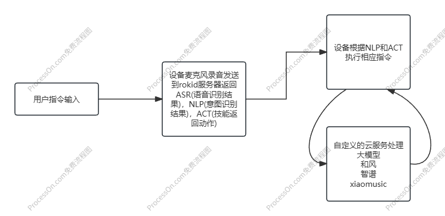

<!-- 这是一张图片，ocr 内容为：设备根据NLP和ACT 执行相应指令 设备麦克风录音发送 到ROKID服务器返回 OROCESSO ASR(语音识别结 用户指令输入 果),NLP(意图识别 结果),ACT(技能返 回动作) 自定义的云服务处理 大模型 和风 智谱 XIAOMUSIC -->

原本的工作流程：用户指令输入 -> 设备麦克风录音发送rokid服务器返回ASR(语音识别结果)，NLP(意图识别结果)，ACT(技能返回动作) -> 设备根据NLP和ACT执行相应指令。

HOOK后的工作原理：用户指令输入 -> 设备麦克风录音发送rokid服务器返回ASR(语音识别结果)，NLP(意图识别结果)，ACT(技能返回动作) ->  自定义的云服务处理 -> 设备根据NLP和ACT执行相应指令。

